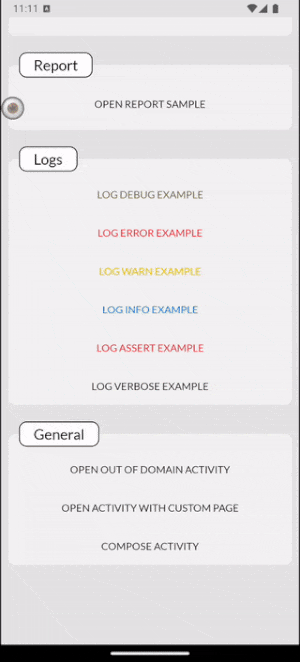
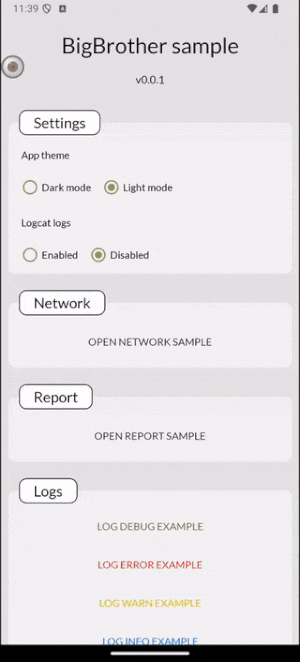
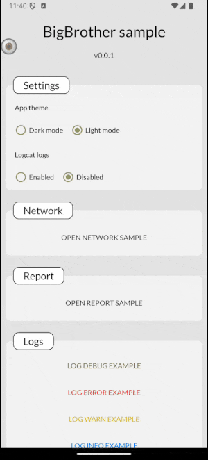
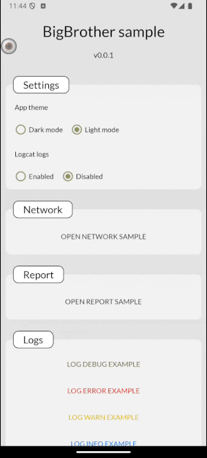

# BigBrother library

Created to improve the manual testing, the BigBrother lib is a tool that allows you to create another tools or use the provided by default.

* **`Network`** - provide an interceptor (to use with OkHttp3) and an interface to see all requests made in during a session
* **`Log`** - provide an interface (and a Timber.Tree) to see the logs
* **`Report`** - a report generator. It will record a timeline using data provided by the other modules (or custom)
* **`Database`** - provide an interface to navigate between your database/sharedPreferences files
* **`Crash`** - when the app crashs, it will show a screen with stackTrace exception and a timeline with a print where the user clicked to cause the error

## Getting started

Big Brother's goal is to provide tools that help developers/QA test their features with Network and Log inputs, so the ideal is to add the library only in the debug build.
To use BigBrother in the app, implements the following dependencies in `build.gradle` on app module:
```groovy
dependencies {
    def bigbrother_last_release = '1.0.0'

    // The version definition is required only on core implementation
    debugImplementation "io.github.mrocigno:big-brother-core:$bigbrother_last_release"

    // == optional ==
    // To record network interaction (need OkHttp3)
    debugImplementation "io.github.mrocigno:big-brother-network"

    // To record logs
    debugImplementation "io.github.mrocigno:big-brother-log"

    // To create a report with all recorded data
    debugImplementation "io.github.mrocigno:big-brother-report"

    // To get crash data
    debugImplementation "io.github.mrocigno:big-brother-crash"

    // To get database/sharedPreferences files
    debugImplementation "io.github.mrocigno:big-brother-database"
}
```

## Setup

Now with de dependencies correctly implemented, we will configure to start using. BB has a few ways to be configured


* ### Single Module project

  In a project with single module we can configure right on application class:

  ```kotlin
  /*
  * Application class under debug build variant folder
  */
  class DebugApplication : Application() {
      
      override fun onCreate() {
          super.onCreate()
  
          // If the big-brother-network was implemented in build.grade
          BigBrother.addNetworkPage(customName = "Network")
  
          // If the big-brother-log was implemented in build.grade
          // Implement together with (Timber lib)[https://github.com/JakeWharton/timber]
          Timber.plant(BigBrotherLogTree())
          BigBrother.addLogPage(customName = "Log")
  
          // If the big-brother-report was implemented in build.grade
          BigBrother.addSessionPage(customName = "Session")
  
          // If the big-brother- was implemented in build.grade
          BigBrother.addDatabasePage(customName = "Database")
  
          // If you want to create some custom tool for your project
          BigBrother.addPage(name = "My Awesome Tool") { bubble: BigBrotherView ->
              MyAwesomeToolFragment()
          }
  
          // If you want to create some custom tool for your project to an specific Activity
          BigBrother.addPage(location = MainActivity::class) {
              page(name = "My Awesome Tool") { bubble: BigBrotherView ->
                  MyAwesomeToolFragment()
              }
          }
  
          // BigBrother starts the watch
          BigBrother.watch(this, isBubbleEnabled = true)
      }
  }
  ```

-----

* ### Multi Module Project

  In a project with multiple modules we have some extra steps, but we can configure through the content provider extending the `BigBrotherProvider` base class and reuse in other projects
  ```kotlin
  /*
  * ContentProvider class under debug variant folder
  * As a ContentProvider, this class will run before the application class
  * So be careful using DI here
  */
  class BigBrotherCustom : BigBrotherProvider() {
  
      /*
      * Here you can create a logic to enable or disable the BigBrother.
      * You also can disable in AndroidManifest.xml as we will see soon
      */
      override val isEnabled get() = true
  
      // Here we will configure all pages that will be rendered in the BigBrother container
      override fun setupPages() {
  
          // If the big-brother-network was implemented in build.grade
          addNetworkPage(customName = "Network")
  
          // If the big-brother-log was implemented in build.grade
          addLogPage(customName = "Log")
  
          // If the big-brother-report was implemented in build.grade
          addSessionPage(customName = "Session")
  
          // If the big-brother- was implemented in build.grade
          addDatabasePage(customName = "Database")
  
          // If you want to create some custom tool for your project
          addPage(name = "My Awesome Tool") { bubble: BigBrotherView ->
              MyAwesomeToolFragment()
          }
  
          // If you want to create some custom tool for your project to an specific Activity
          addPage(location = MainActivity::class) {
              page(name = "My Awesome Tool") { bubble: BigBrotherView ->
                  MyAwesomeToolFragment()
              }
          }
      }
  }
  ```

  After creating the class, we will configure it in the debug manifest:
  ```xml
  <?xml version="1.0" encoding="utf-8"?>
  <manifest xmlns:android="http://schemas.android.com/apk/res/android">
  
      <application>
  
          <!-- here in AndroidManifest we also can enable/disable the provider using manifestPlaceholder -->
          <provider
              android:authorities="${applicationId}.BIGBROTHER"
              android:name=".BigBrotherCustom"
              android:enabled="true"
              android:exported="false"/>
  
      </application>
  
  </manifest>
  ```

  > Example of enable/disable with manifestPlaceholder
  > in `build.gradle`
  > ```groovy
  > android {
  >    defaultConfig {
  >        applicationId "example.manifest.app"
  >    }
  >    productFlavors {
  >        dev {
  >            manifestPlaceholders.bigbrotherEnabled = "true"
  >        }
  >        hom {
  >            manifestPlaceholders.bigbrotherEnabled = "false"
  >        }
  >    }
  > }
  > ```
  >
  > in `AndroidManifest.xml`
  > ```xml
  > <provider
  >    android:authorities="${applicationId}.BIGBROTHER"
  >    android:name=".BigBrotherCustom"
  >    android:enabled="${bigbrotherEnabled}"
  >    android:exported="false"/>
  > ```

  Then finally we start the watch in Application class
  ```kotlin
  class SampleApplication : Application() {
  
      override fun onCreate() {
          super.onCreate()
  
          // Implement together with [Timber lib](https://github.com/JakeWharton/timber)
          Timber.plant(BigBrotherLogTree())
  
          // Start the watch
          BigBrother.watch(this, isBubbleEnabled = true)
      }
  }
  ```

### And that's it! You are ready to create and use tools in BigBrother

## Network
The network implementation allows you to receive requests and responses from your services without needing to be plugged into Android Studio, all within the app with a user-friendly interface that helps both Android devs, backend devs who are doing integrated testing and even QA to analyze the error before opening a bug card.

<details>
    <summary><b><i>Setup Network</i></b></summary>

* With OkHttp3

  Add the BigBrotherInterceptor into your OkHttp3 client.

  ```kotlin
  // Using the extension
  private val okHttpClient : OkHttpClient = OkHttpClient.Builder()
      .connectTimeout(30, TimeUnit.SECONDS)
      .readTimeout(30, TimeUnit.SECONDS)
      .bigBrotherIntercept(blockList = arrayOf(
          "dont/intercept/this",
          "not/even/this"
      ))
      .build()
  
  // OR add raw class
  private val okHttpClient : OkHttpClient = OkHttpClient.Builder()
      .connectTimeout(30, TimeUnit.SECONDS)
      .readTimeout(30, TimeUnit.SECONDS)
      .addInterceptor(BigBrotherInterceptor(blockList = arrayOf(
          "dont/intercept/this",
          "not/even/this"
      )))
      .build()
  ```

* Custom (to support legacy implementation like AsyncTask)

  To manually add entries to network section

  ```kotlin
  BigBrotherNetworkHolder.addEntry(
      NetworkEntryModel(
          fullUrl = "www.google.com/example",
          url = "/example",
          statusCode = 200,
          hour = "10:00",
          method = "GET",
          request = NetworkPayloadModel(
              headers = mapOf("Authorization" to listOf("abc123")),
              body = null
          ),
          response = NetworkPayloadModel(
              headers = emptyMap(),
              body = """
                  {"response": "value"}
              """
          ) 
      )
  )
  ```
</details>


## Log

The Log implementation allows you to view the logs (set by you) in a user-friendly interface without needing to be connected to Android Studio's logact

<details>
    <summary><b><i>Setup Log</i></b></summary>

  In your debug application you need to plant `BigBrotherLogTree` in the [Timber lib](https://github.com/JakeWharton/timber)
  ```kotlin
  class SampleApplication : Application() {
  
      override fun onCreate() {
          super.onCreate()
        
          Timber.plant(BigBrotherLogTree())
      }
  }
```

</details>



## Report

The Report implementation will record all the data provided by the other implementations and save it to a database to retrieve the data for later troubleshooting.
This implementation requires no setup



## Database

The Database implementation allows you to view your databases/tables and make queries with SQL, it also allows you to view and edit your sharedPreferences files.
This implementation requires no setup



## Crash

The crash implementation will display a screen with the exception stackTrace and a timeline with a print of where the user clicked whenever a crash occurs in your application.
This implementation requires no setup


